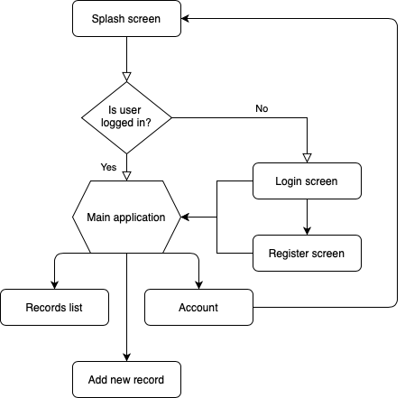

<h1>Sport recorder app</h1>

minSdkVersion - 23 targetSdkVersion - 30

<h2>Description</h2>

App developed as a test project for Etnetera. App should provide basic functionality for defining exercise related data. These are: name, location, duration, save location. User can choose to save to local or remote database, in case of local database, data will be lost after logout. As for location selection, user can select any place on map.
<h2>Some of used libraries</h2>

<h3>1. Maps</h3>

- osmdroid (free opensource)
<h3>2. Places API(reversed geocoding)</h3>

- osm bonus back - com.github.MKergall (free)
<h3>3. Networking</h3>

- retrofit(there is ready implementation for firebase database)
<h3>4. Local data persistance</h3>

- Room database

<h3>5. Dependency injection</h3>

- Koin

<h2>Application flow</h2>

